<div align="center">

<picture>
  <source media="(prefers-color-scheme: dark)" srcset="./assets/mahdiyar-neon-banner.svg">
  <source media="(prefers-color-scheme: light)" srcset="./assets/mahdiyar-neon-banner.svg">
  
</picture>

<br>

<a href="https://readme-typing-svg.demolab.com/">
  
</a>

<br>

<a href="mailto:YOUR_EMAIL@example.com">
  
</a>
&nbsp;
<a href="https://www.linkedin.com/in/mahdiyar-namazifar/">
  
</a>
&nbsp;
<a href="https://github.com/Mahdiyar185">
  
</a>
&nbsp;


<br><br>


&nbsp;

&nbsp;

&nbsp;

&nbsp;

&nbsp;


</div>

---

## ⚡ About Me

```yaml
name: Mahdiyar Namazifar
role: QA Engineer
specialization: Manual & Automation Testing
automation: Playwright
secondary_role: UI/UX Designer
design: Figma • Design Systems • Wireframes • Prototypes • Responsive Design
api_testing: Postman
languages: Java • Python • JavaScript • C • HTML • CSS
workflow: Git • GitHub • Confluence
ai: AI-assisted testing • design • research • documentation
current_focus: Advanced QA • Playwright Automation • UI/UX • AI-assisted workflows
```

- 🧪 Manual & Automation Testing
- 🎭 End-to-End UI Automation with Playwright
- 🔌 API Testing with Postman
- 🔍 Functional, Regression, Smoke & Exploratory Testing
- 🐞 Test Case Design, Bug Reporting & Quality Analysis
- 🎨 UI/UX Design, Design Systems & Prototyping
- 🤖 Practical AI-assisted testing, design and engineering workflows
- 🧩 Bridging product usability with software quality

---

## 🧠 My Core Workflow

<div align="center">

`UNDERSTAND` → `DESIGN` → `TEST` → `AUTOMATE` → `ANALYZE` → `IMPROVE`

<br><br>

| Quality | Automation | Design | AI |
|:---:|:---:|:---:|:---:|
| 🧪 Manual Testing | 🎭 Playwright | 🎨 UI/UX | 🤖 AI-Assisted Workflows |
| 🔍 Functional Testing | 🔁 Regression Automation | 🧩 Design Systems | 🧠 Analysis & Ideation |
| 🐞 Bug Analysis | 🌐 E2E Testing | 📐 Wireframes | ⚡ Productivity |
| 🔌 API Testing | 📊 Test Reporting | 🖥️ Responsive Design | 🛠️ Problem Solving |

</div>

---

## 🧰 Tech Stack

### 🧪 QA & Automation

<div align="center">


&nbsp;&nbsp;

&nbsp;&nbsp;

&nbsp;&nbsp;

&nbsp;&nbsp;

&nbsp;&nbsp;


</div>

<p align="center">
Playwright &nbsp;•&nbsp; Postman &nbsp;•&nbsp; Test Automation &nbsp;•&nbsp; Functional Testing &nbsp;•&nbsp; Regression Testing &nbsp;•&nbsp; API Testing
</p>

---

### 🎨 UI/UX & Product Design

<div align="center">


&nbsp;&nbsp;

&nbsp;&nbsp;

&nbsp;&nbsp;


</div>

<p align="center">
UI Design &nbsp;•&nbsp; UX Design &nbsp;•&nbsp; Design Systems &nbsp;•&nbsp; Wireframing &nbsp;•&nbsp; Prototyping &nbsp;•&nbsp; Responsive Design &nbsp;•&nbsp; Interaction Design &nbsp;•&nbsp; Motion Design
</p>

---

### 💻 Programming & Web

<div align="center">


&nbsp;&nbsp;

&nbsp;&nbsp;

&nbsp;&nbsp;

&nbsp;&nbsp;

&nbsp;&nbsp;


</div>

---

### 🧩 Tools & Workflow

<div align="center">


&nbsp;&nbsp;

&nbsp;&nbsp;

&nbsp;&nbsp;


</div>

---

## 🤖 AI-Assisted Engineering & Design

<div align="center">

### AI is part of my workflow — not a replacement for engineering judgment.

</div>

I use AI as a practical layer across the software lifecycle:

```text
QA
├── Test scenario ideation
├── Test case generation & refinement
├── Edge-case discovery
├── Bug investigation
└── Automation assistance

DESIGN
├── UX exploration
├── Design ideation
├── Content & interaction exploration
├── Design-system assistance
└── Rapid iteration

ENGINEERING
├── Code assistance
├── Debugging support
├── Documentation
├── Research
└── Workflow optimization
```

---

## 🧪 Testing Knowledge

<div align="center">

`Test Case Design` · `Functional Testing` · `UI Testing` · `API Testing`

`Regression` · `Smoke Testing` · `Exploratory Testing` · `Negative Testing`

`Bug Reporting` · `Bug Lifecycle` · `End-to-End Testing` · `Test Automation`

`Usability Testing` · `Risk Awareness` · `Quality Analysis`

</div>

---

## 🚀 Selected Work

<table>
<tr>
<td width="50%" valign="top">

### 🎓 Student Management System

Java / JavaFX team project focused on application functionality, UI implementation, debugging and software development workflow.

**Focus**

`Java` `JavaFX` `UI` `Software Development`

</td>

<td width="50%" valign="top">

### 🎨 Student Web Application — UI/UX

UI/UX design project focused on user flows, responsive interfaces, reusable components, prototypes and design-system thinking.

**Focus**

`Figma` `UI/UX` `Design Systems` `Prototype`

</td>
</tr>

<tr>
<td width="50%" valign="top">

### 🎭 Playwright Testing

Automation work focused on browser-based testing and building maintainable automated test scenarios.

**Focus**

`Playwright` `JavaScript` `E2E` `Automation`

</td>

<td width="50%" valign="top">

### ⚡ AI-Assisted QA & Design

Exploring practical AI workflows for test analysis, automation assistance, design exploration, documentation and productivity.

**Focus**

`AI` `QA` `Automation` `Design`

</td>
</tr>
</table>

> More repositories and case studies will be added as they reach a publishable stage.

---

## 📊 GitHub Activity

<div align="center">


</div>

<br>

<div align="center">


</div>

---

## 🐍 Contribution Activity

<div align="center">


</div>

---

## 🎯 Current Focus

<div align="center">

🧪 **Advanced QA Engineering**

&nbsp;•&nbsp;

🎭 **Playwright Automation**

&nbsp;•&nbsp;

🎨 **UI/UX & Design Systems**

&nbsp;•&nbsp;

🤖 **AI-Assisted Workflows**

&nbsp;•&nbsp;

🚀 **Real-World Projects**

</div>

---

## 📫 Let's Connect

<div align="center">

<a href="mailto:YOUR_EMAIL@example.com">Email</a>
&nbsp;·&nbsp;
<a href="https://www.linkedin.com/in/mahdiyar-namazifar/">LinkedIn</a>
&nbsp;·&nbsp;
<a href="https://github.com/Mahdiyar185">GitHub</a>

<br><br>

<i>Test with intent. Design with purpose. Build for people.</i>

</div>
